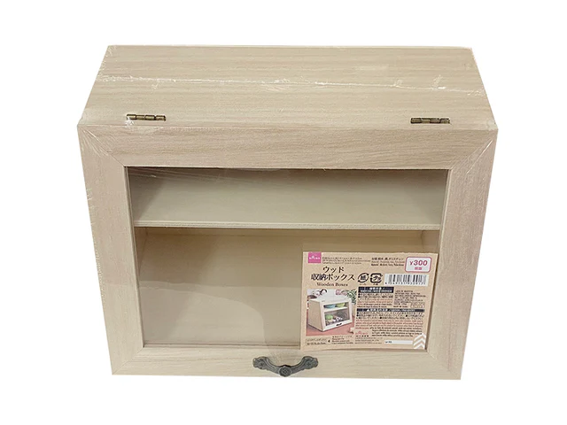

# Resistor / Small parts storage

This is my system for storing small electronic components. I'm really happy with it, so wanted to share in case others might like one. You'll need a couple of non-3d printed parts, namely:

- small wooden display boxes from Daiso (chain of Japanese dollar stores). They're about $6 each
- a number of 15ml centrifuge tubes. I've had good results buying 100 for about $10 on Aliexpress

With that, print all the parts- you'll need the following for each rack:

1x back_panel.stl
1x backstop.stl
2x back_support.stl
1x front_panel.stl
2x middle_support.stl
1x shelf.stl

If you'd also want to add in the small drawers, print:

1x draweer_holder.stl
3x drawer.stl

What I did was to:

1. Prep the Box

- remove the hinged door on the front
- remove the interior shelf
- stain the box
- seal it with spray varnish

2. Print the parts

3. Assemble

- glue the two back_support.stl in the back corners of the box
- glue the backstop.stl to the back of the box
- glue back_panel.stl in
- glue the two middle_support.stl to the side of the box
- glue the front_panel.stl onto the middle supports
- glue the shelf.stl. Its best to do that before the glue fully sets on the front panel, as it may need to be separated a little to allow the shelf to be placed correctly.

Then, optionally…

4. Add the Drawers

- apply glue to the bottom, back, and sides of drawer_holder.stl and slide it into the top
- slide in the three drawers to make sure that the side walls of drawer_holder don't move too much to the side
- move the drawers in and out a few times while the glue is setting to make sure that the drawers don't get stuck
